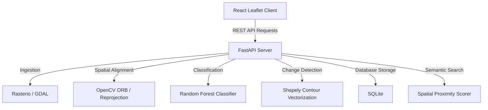

# System Architecture

The AI-Powered Multi-Temporal Satellite Change Intelligence system uses a decoupled client-server architecture designed for high-performance offline GIS analysis.

## Core Pipeline Flow

1. **Ingest**: GeoTIFF files are uploaded, metadata (CRS, transform) is parsed with `rasterio`, and 3-band RGB PNGs are rendered to `backend/static` for browser-compatible `ImageOverlay` rendering.
2. **Alignment**:
   - The Target (2026) image is reprojected onto the Reference (2024) grid using standard geospatial resampling.
   - Sub-pixel ORB keypoint matching determines a homography warp matrix to resolve local camera shifts/misregistration.
3. **Preprocessing**: Normalizes float bands to $[0.0, 1.0]$ and masks cloud/shadow areas.
4. **Segmentation**: A Random Forest classifier partitions the landscape into five land cover classes: Building, Road, Vegetation, Water, and Bare land.
5. **Change Detection**: Pixel-level transition mapping grouped into four high-level change classes (New Construction, Road Change, Vegetation Change, Water Change), followed by morphological filtering to suppress noise.
6. **Vectorization**: Polygons are simplified using Shapely and transformed back into longitude/latitude coordinates.
7. **Semantic Search**: Text search matches query intent to change properties, implementing spatial proximity checks (e.g., matching "construction near roads" by checking building distances to the road mask).
